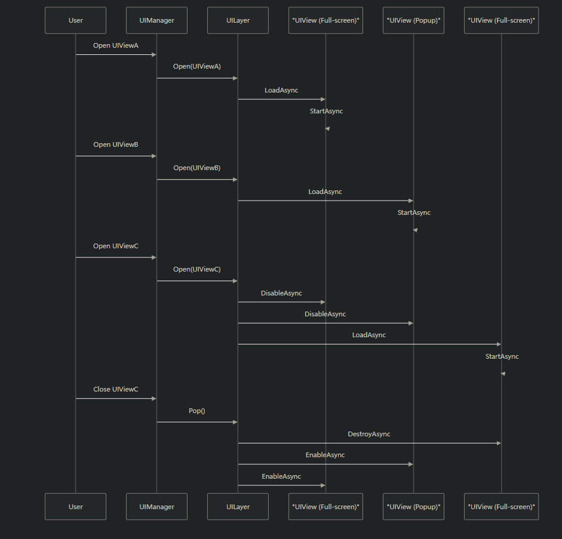
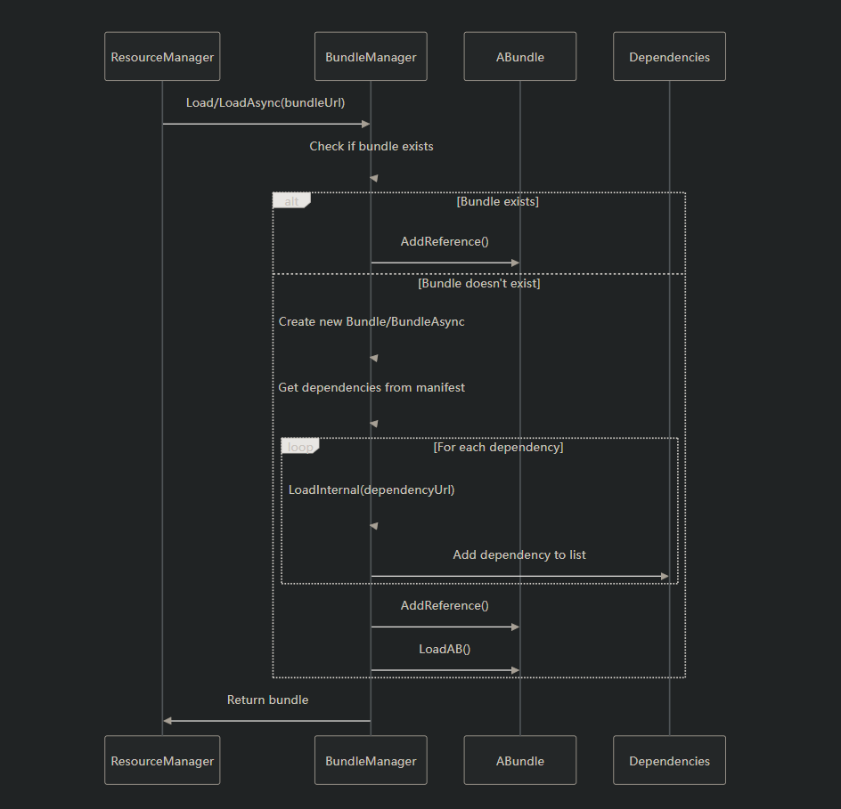
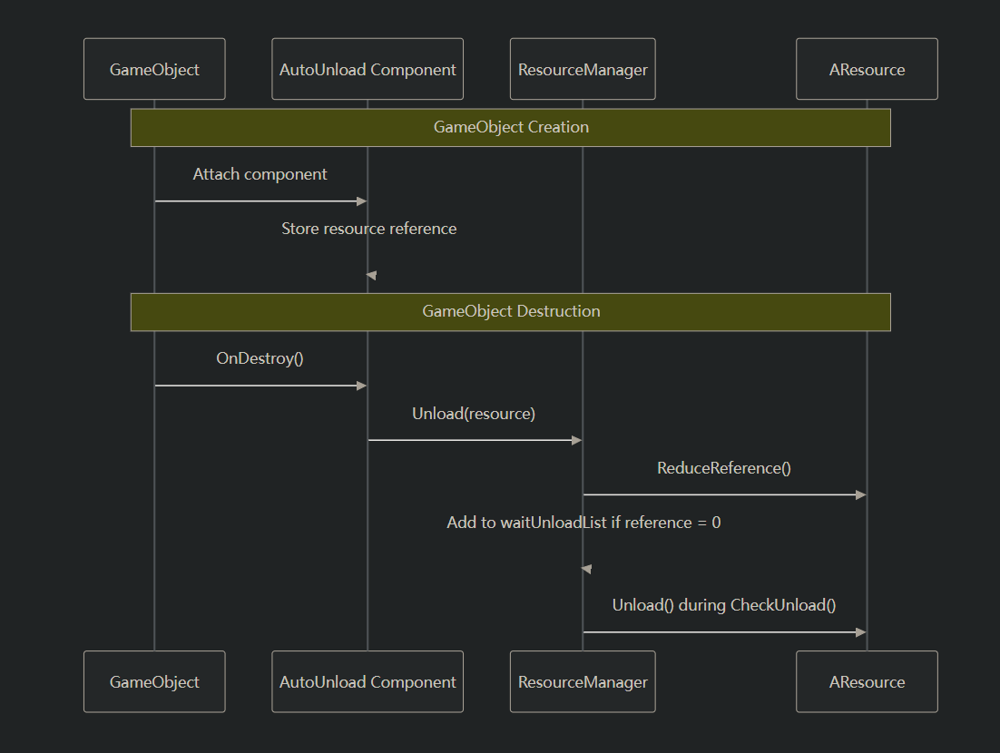
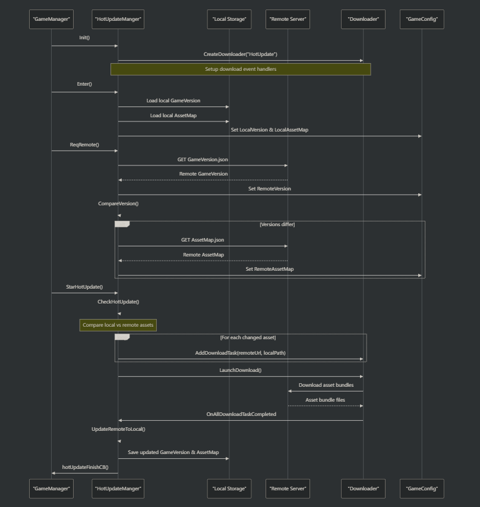
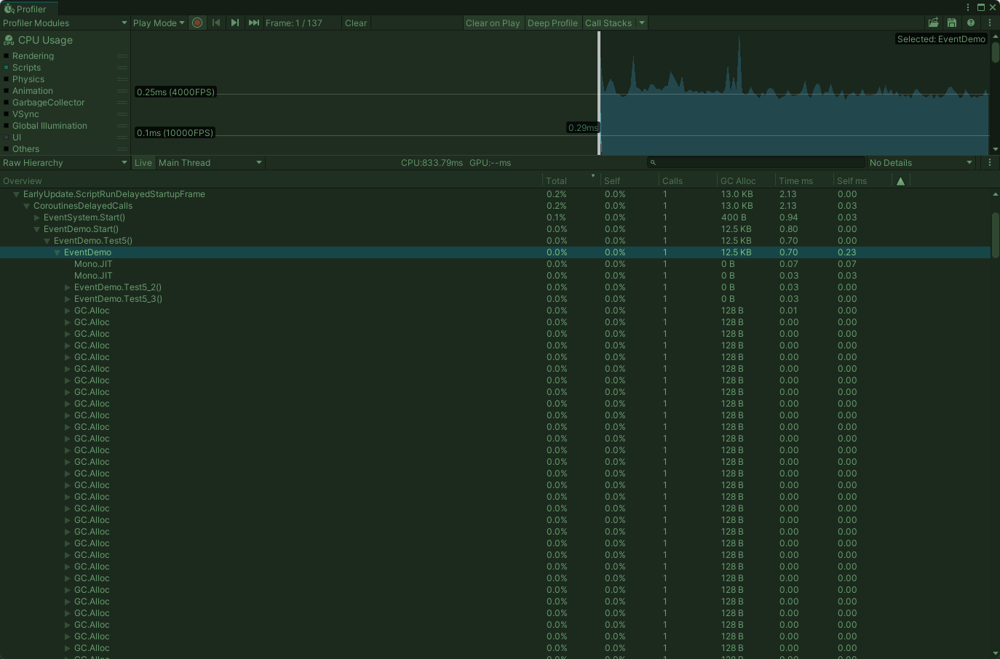
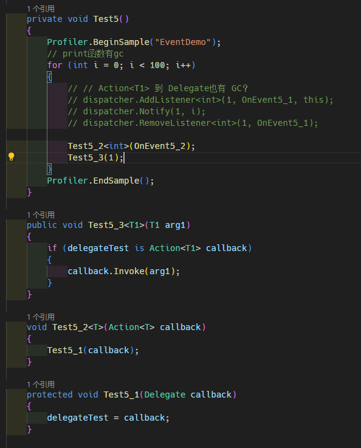
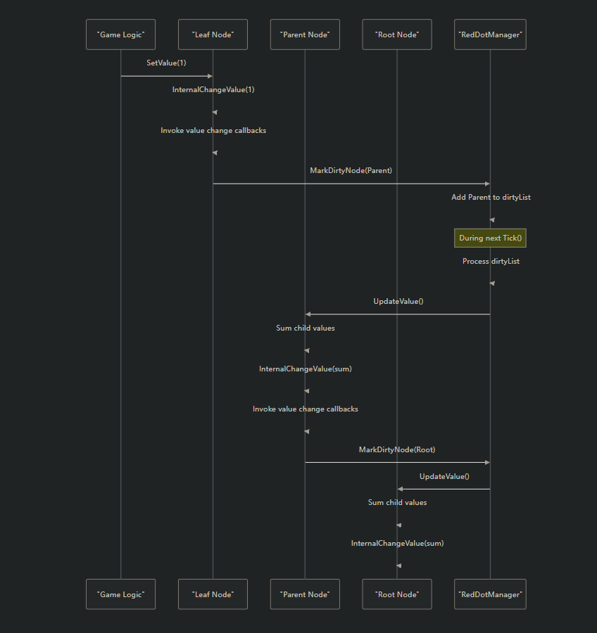

# 总览
HaloFrame 是一个基于 Unity 的游戏客户端框架，专注于 UI 管理、事件通信、资源加载与红点系统等核心模块的设计与优化，适用于中大型游戏项目的开发。

## 核心模块
[UI框架](#ui框架)：支持全屏/弹窗分层管理，基于 CustomStack 实现界面栈控制。

[资源加载](#资源加载)：包含 Bundle 管理、热更新支持、下载任务调度等功能。

[事件系统](#事件系统)：支持多参数事件注册与触发，保证回调顺序一致性，防止运行时异常。

[红点系统](#红点系统)：提供树形结构的红点节点管理，支持动态绑定与状态传播。

# [UI框架](#ui框架)
## UI层级管理
1. 界面根据不同层级，划分到不同的UILayer中管理
2. UILayer使用CustomStack来管理全屏与弹窗界面
3. 新界面如果是弹窗则不做处理，如果是全屏界面，则要关闭上一个界面

## UI生命周期
LoadAsset - Awake - Start - Enable - Disable - Destroy - ReleaseUI

UIView
 - UIGameView 游戏界面
 - UISubView 子界面

## 子界面
1、子界面理论上和普通界面一样，可以单独打开使用

2、子界面也可以继续创建子界面

3、界面之间通过ChildList建立父子关系

## 框架设计思路
Q：为什么需要区分弹窗与全屏？
A：为了让被全屏覆盖的UI可以隐藏，减少drawcall和运行时的消耗。

Q：每个界面为什么要拆分单独的Canvas
A：为了方便管理，每个界面都单独管理自己的Canvas，方便管理UI的层级关系，某个界面元素变更时不会影响其他界面元素。

Q：为什么不直接使用SetActive来显示隐藏界面
A：减少网格重建带来的消耗，每个canvas下的UI元素变动只会影响当前界面

Q：为什么同一个界面打开多次，也会创建多个预制体
A：界面打开顺序：1(全屏) 2 3(全屏) 4，界面回退时，为了解决这种情况下界面可以按栈中顺序返回

## 待优化
- 对栈中相同界面的预制体做堆叠限制
- 同一帧连续压入多个弹窗，如何保证顺序，先打开的先显示？

## 后续计划
- UI Item生命周期管理
- UI代码自动生成
- UI组件自动绑定
- UI动效管理

# [资源加载](#资源加载)
资源管理器是 HaloFrame 中的一个基础系统，用于处理应用程序整个生命周期中资源的加载、实例化和卸载。它在 Unity 的资源管理之上提供了一个抽象层，以简化资源处理，同时通过引用计数和依赖项跟踪来优化内存使用。
功能如下：
1. 使用引用计数来管理 bundle 的生命周期
2. 自动依赖关系解析和管理
3. 支持同步和异步加载
4. 自动卸载未使用的捆绑包
5. 自定义文件路径解析

## 资源加载流程

## 依赖管理
系统使用 AssetBundleManifest 自动处理 bundle 依赖关系：
1. 加载 bundle 时，系统会检查清单中的依赖项
2. 每个依赖项都已加载（使用与父级相同的同步/异步方法）
3. 依赖关系在 bundle 的 dependencies 列表中进行跟踪
4. 卸载 bundle 时，其所有依赖项的引用计数都会减少

## 引用计数
1. 当请求一个包时，它的引用计数会增加
2. 当不再需要某个 bundle 时， Unload() 会减少其引用计数
3. 如果引用计数达到零，则将捆绑包添加到等待列表中
4. 在下一次 CheckUnload() 调用期间，等待列表中的包将被卸载
5. 卸载 bundle 也会减少其依赖项的引用计数

## 自动卸载
自动卸载 (Auto Unload) 实现为一个简单的 MonoBehaviour 组件，该组件会附加到通过资源系统加载的游戏对象 (GameObject)。当游戏对象被销毁时，该组件会自动触发其关联资源的卸载过程。

## 热更新
热更新流程：
1. 版本检查 ：使用 CompareVersion() 比较本地和远程版本
2. 资产迭代 ：循环遍历 GameConfig.RemoteAssetMap 中的所有条目
3. MD5 比较 ：比较本地和远程 AssetInfo 对象之间的 MD5 哈希值
4. 任务累积 ：将更改的资产添加到下载队列并计算大小

# [事件系统](#事件系统)

## 测试用例：
- 重复监听
- 事件A触发，回调方法中移除了事件A的监听
- 事件A触发，回调方法中移除了事件B的监听
- 连续重复触发多个事件id，能否保证回调的顺序正确性，即先触发的事件先回调。
- 值类型装箱
- 事件触发时，监听对象被销毁了

## 在遍历回调方法列表时，执行回调方法，可能导致回调方法列表被修改？
在移除监听时，判断当前事件id是否正在执行中，如果是则把EventInfo中IsRelease设置为true，等遍历完毕之后再统一回收并移除

## 关注内容
- 实现事件系统的时候如果用泛型委托的要注意了，委托在类型转化的时候会产生GC
- 不能清楚知道事件名对应几个变量，需要自己定义的时候留意一下

# [红点系统](#红点系统)
HaloFrame 中的红点系统采用层级节点结构，通知计数向上传递。例如，如果子类别中出现新商品，则该子类别及其父类别都会显示通知。
该系统由三个主要部分组成：
1. RedDotManager ：通知系统的中央控制器
2. RedDotNode ：表示层次结构中的节点，管理值和父子关系
3. RedDotItem ：显示通知点或计数的 UI 组件

## RedDotNode  
该节点的一个关键特性是值传播——当叶节点的值发生变化时，它将其父节点标记为"脏"，并且父节点在下一个更新周期中通过对所有子节点的值求和来重新计算其值。
1. 具有名称和完整路径
2. 维护一个值（通知计数）
3. 保存对其父级和子级的引用
4. 提供修改值和管理层次结构的方法

## RedDotItem  
RedDotItem 是一个 MonoBehaviour，用于将 RedDot 系统连接到 Unity UI 元素。
1. 绑定到层次结构中的节点路径
2. 根据通知值变化更新视觉元素
3. 支持两种显示模式：仅点或数字计数

## 运行过程
红点系统的核心功能之一是自动值传播。当叶节点的值发生变化时：
1. 节点更新其值
2. 它通过回调通知监听器变化
3. 它在 RedDotManager 中将其父级标记为"脏"
4. 在下一个更新周期中，脏节点通过对其子节点的值求和来重新计算其值
5. 这个过程不断重复，直到根节点

